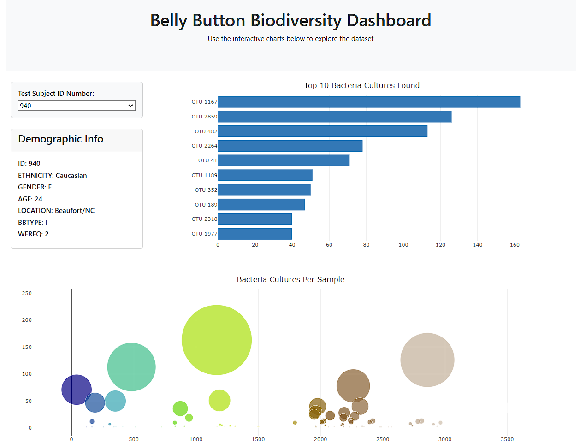

# Belly Button Biodiversity Dashboard  
**Creators**: Luke Roberts 
**Date**: April 2025

## Table of Contents
- [Belly Button Biodiversity Dashboard](#belly-button-biodiversity-dashboard)
  - [Table of Contents](#table-of-contents)
  - [Project Description](#project-description)
  - [Research Questions to Answer](#research-questions-to-answer)
  - [Features](#features)
  - [Deployment](#deployment)
    - [GitHub Pages or Local Deployment](#github-pages-or-local-deployment)
    - [Dashboard Screenshot](#dashboard-screenshot)
  - [Key Findings](#key-findings)
  - [Recommendation](#recommendation)
  - [Methodology](#methodology)
    - [Tools Used](#tools-used)
    - [Files](#files)
  - [Ethical Considerations](#ethical-considerations)
  - [Opportunities for Further Analysis](#opportunities-for-further-analysis)
  - [Resources](#resources)

## Project Description
This project creates an interactive dashboard using D3.js and Plotly to explore the Belly Button Biodiversity dataset. The dashboard visualizes microbial data from human belly buttons, allowing users to view demographic info and microbial distribution across different subjects.

## Research Questions to Answer
1. What are the most prevalent bacterial cultures found in each subject?
2. How does bacterial diversity vary between individuals?
3. Can the data reveal correlations with demographic factors (e.g., age, location, frequency of washing)?

## Features
- **Interactive Dashboard**: Users can select a subject ID to update metadata and charts dynamically.
- **Bar Chart**: Displays the top 10 bacterial cultures found for each selected individual.
- **Bubble Chart**: Shows all bacterial culture values per subject with OTU IDs.
- **Demographic Panel**: Presents key metadata such as age, gender, and washing frequency.

## Deployment
### GitHub Pages or Local Deployment
**1. Clone the Repository**
```bash
git clone https://github.com/iniirie/belly-button-challenge.git
```

**2. Open in Browser**
Open `index.html` in your preferred browser. Ensure the directory structure maintains the relative paths for `app.js` and `samples.json`.

### Dashboard Screenshot  



## Key Findings
- Each subject has a unique microbiome composition, with only a few overlapping dominant OTUs.
- Some individuals exhibit high microbial diversity, while others show a narrow concentration of specific OTUs.
- Washing frequency appears in the metadata but was not explicitly linked to OTU distributions in this version.

## Recommendation
- Add additional visualizations such as pie charts or heatmaps to show distribution trends across demographics.
- Normalize OTU counts for better inter-subject comparison.
- Include filtering by gender, location, or age group to explore subgroup-specific microbial trends.

## Methodology
### Tools Used
- **HTML & Bootstrap**: Structured and styled the dashboard layout.
- **D3.js**: Loaded and filtered `samples.json` data dynamically.
- **Plotly**: Built responsive charts including bubble and bar plots.
- **JavaScript**: Scripted data handling and DOM updates via `app.js`.

### Files
- `index.html`: Main page layout with placeholders for plots and metadata.
- `app.js`: All logic to build plots and update dashboard elements based on selection.
- `samples.json`: Contains sample names, OTU data, and metadata used throughout the app.

## Ethical Considerations
This data is publicly available and intended for educational purposes. No personal identifiers are included. The project respects user privacy and promotes microbiome awareness in an informative context.

## Opportunities for Further Analysis
- Conduct statistical analysis on OTU prevalence vs. demographics.
- Integrate machine learning for classifying individuals based on microbiome signatures.
- Expand the dashboard with temporal data (e.g., changes over time).

## Resources
- **Dataset Source**: [Static sample JSON from edX](https://static.bc-edx.com/data/dl-1-2/m14/lms/starter/samples.json)
- **D3.js Documentation**: https://d3js.org/
- **Plotly JS**: https://plotly.com/javascript/
- **Bootstrap**: https://getbootstrap.com/
